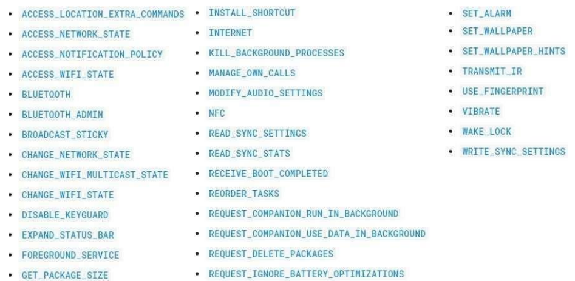
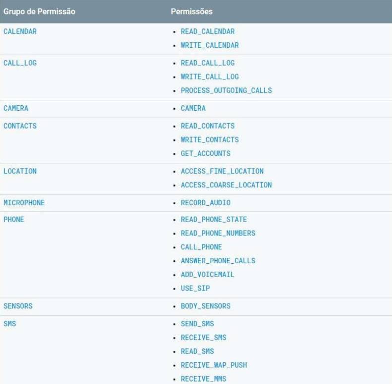

 
<h2>Estudando Kodular 🤳</h2>

Desenvolvimento de Sistemas III - ETEC

<h2>Agenda 05: Permissões.</h2>

## 1. Introdução

- o sistema operacional Android é rico no requisito segurança, e o desenvolvedor Mobile deve aplicar nos aplicativos os padrões de segurança solicitados pelo sistema para que seu aplicativo possa se destacar no mercado e ser aprovado para a publicação na loja de aplicativos da Google.
- para alguns projetos, o aplicativo necessita de acesso a recursos de Hardwares e Softwares do dispositivo Mobile e se o desenvolvedor não conhecer as formas de permitir a utilização dos recursos, o aplicativo não funciona.
- esses recursos se dividem em alguns grupos e, em determinadas situações, o aplicativo precisa ser transparente com o usuário, solicitando o seu consentimento para acessar algumas áreas do dispositivo Mobile.
- as permissões não devem ser encaradas como um problema para o desenvolvedor, elas devem ser vistas como algo que traz benefícios e segurança para ambas as partes e contribui para a segurança de um sistema operacional cada vez mais utilizado em todo o mundo.
- exemplos: acesso a informações particulares como fotos e vídeos do usuário, acesso a informações do cartão de memória de um dispositivo, câmera, microfone etc. 
  - se esses recursos não forem controlados pelo sistema operacional, e sua liberação de utilização for liberada pelos usuários, podem surgir problemas graves, tornando o sistema falho e de baixa segurança, o que seria um paraíso para pessoas má intencionadas e para os criminosos digitais!

> A regra primordial é que o sistema operacional possua um conjunto de permissões para que o aplicativo acesse e/ou utilize determinadas áreas do dispositivo. Por padrão, todas as permissões são bloqueadas, desta forma não corre o risco de um aplicativo prejudicar o outro ou até mesmo o sistema operacional do aparelho, sem ter que passar por uma autorização prévia.

- as permissões são exclusivas, ou seja, o que é autorizado para um aplicativo, não será autorizado, de maneira automática, para os demais.
- os recursos são divididos basicamente em “Permissões Normais” e “Permissões Perigosas”.

## 2. Permissões Normais

- são aquelas que o aplicativo utiliza e que oferecem um pequeno risco à privacidade do usuário ou ao sistema operacional. 
- ocorrem durante a execução do aplicativo e o sistema operacional concede a devida autorização automaticamente, sem a necessidade de informar o usuário.
- entre os principais recursos desse grupo, destacam-se “VIBRATE”, e o uso do “BLUETOOTH”, “INTERNET” e “NFC”.
- exemplo: utilização da Internet por um aplicativo de rede social.

 
<em>Principais “Permissões Normais”.</em>
 

## 3. Permissões Perigosas

- são aquelas que comprometem a privacidade do usuário e podem comprometer o sistema operacional e demais aplicativos. 
- para utilizar essas permissões, o aplicativo necessita alertar sobre a intenção da utilização, e durante a execução, o usuário necessita conceder a sua autorização expressa para a liberação da permissão, por meio de uma mensagem exibida em tela.
- exemplo: nos programas de edição de fotos, o aplicativo solicita a permissão de acesso ao usuário as pastas de galeria de imagens do dispositivo.

 
<em>Principais “Permissões Perigosas”.</em>
 

- todos os recursos da lista de “Permissões Perigosas” são pertinentes, mas destaca-se o uso da localização por GPS, utilização de chamadas de voz, utilização de SMS, calendário, câmera e até mesmo acesso aos arquivos e contatos do dispositivo.

## 4. Uso de permissões de acesso aos recursos de Software

- projetos executados nos sistemas operacionais inferiores ao Android 5.1, solicitavam a autorização do usuário para as permissões utilizadas no momento da instalação.
- a partir da versão 6.0, as permissões são autorizadas na primeira execução do aplicativo.

## 5. Uso de permissões de acesso aos recursos de Hardware

- é importante o desenvolvedor declarar as permissões de maneira correta, evitando aborrecimentos do usuário, pois nem todos os dispositivos são iguais, e muito menos oferecem todos os recursos como câmeras, GPS, Bluetooth e etc.

> O sistema operacional conta com outros tipos de permissão, sendo fundamental acompanhar na documentação oficial, [disponível aqui](https://developer.android.com/guide/topics/permissions/overview?hl=pt-br#normal-dangerous).

## 6. Exemplo de utilização de permissões em um projeto

> Este exemplo contempla apenas a solicitação de permissão ao sistema operacional Android; criar um novo projeto para praticar como configurar o processo de permissões que altera o arquivo “AndroidManifest.xml”, através da plataforma Kodular e realizar o teste com o dispositivo para exemplificar o processo de solicitação de permissão para o usuário.

- desenvolvimento do layout da aplicação [aqui](https://www.youtube.com/watch?v=8eueo0lkzr4).
- criando a programação em blocos a partir [deste vídeo](https://www.youtube.com/watch?v=Ui2DWwwgcRc).

---

## Fichário

<em>
"Altere o aplicativo “Permissao”, excluindo a permissão de acesso para a câmera do dispositivo e inclua uma permissão para o aplicativo acessar o GPS. Salve seu projeto e envie juntamente para seu professor um vídeo ou prints de tela apresentando seu funcionamento."
</em>

https://github.com/monicaquintal/disciplina_DS_III_ETEC/assets/111545468/83b5993d-4725-4c35-ae72-8c4a817545a8

</div

---

[Voltar ao início.](https://github.com/monicaquintal/disciplina_DS_III_ETEC)
