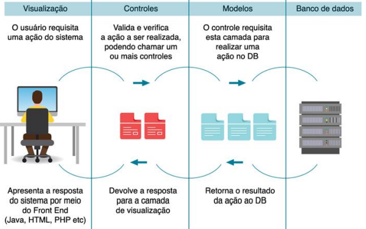

  
<h2>Estudando PHP! 🐘</h2>

Desenvolvimento de Sistemas III - ETEC

<h2>Agenda 10: Padrão MVC (MODEL VIEW CONTROLLER).</h2>

## 1. O que é MVC?

- sigla para Model-View-Controller (Modelo-Visão-Controle).
- trata-se de um padrão de arquitetura para o desenvolvimento de software.
- pode ser utilizado em desevenvolvimento WEB, Desktop ou Mobile, sem nenhuma objeção.
- tem como característica a separação de regras e lógicas do negócio, da apresentação ao usuário, o que permite ao desenvolvedor o maior controle sobre o projeto, tornando possível a manutenção individual de cada camada (MVC), proporcionando maior segurança no ciclo de desenvolvimento do projeto.

<em>Quadro explicativo: Padrão MVC.</em>
 

## 2. Como surgiu?

- na década de 70, Christopher Alexander, um engenheiro civil, criou o considerado primeiro padrão de projeto. 
- em 1979, Trygve Reenskaug idealizou o atualmente chamado padrão MVC: um padrão de arquitetura que projetava o softwareem três camadas independentes (modelo, visão e controle - MVC).

## 3. Benefícios da utilização de um padrão / arquitetura de projeto

- aumento de produtividade.
- uniformidade na estrutura do site.
- redução de complexidade no código.
- sites mais fáceis de manter.
- códigos e sites mais fáceis para manutenções e reuso.
- facilita a documentação.
- estabelece um vocabulário comum de projeto entre desenvolvedores.
- permite a reutilização de módulos do site em outros sites.
- considerada uma boa prática utilizar um conjunto de padrões para resolver problemas maiores que, sozinhos, não conseguiriam.
- ajuda a construir sites confiáveis com arquiteturas testadas.
- reduz o tempo de desenvolvimento de um projeto / site.

## 4. O padrão MVC

- principal característica: isolar as regras de negócios, da lógica e da apresentação de interface ao usuário, buscando como principal benefício a possibilidade de que cada item, em cada camada, seja modificados sem a necessidade da alteração de outras camadas, tornando o projeto mais flexível e com uma grande possibilidade de reaproveitamento de código.
- camadas:

### a) Model:

- responsável pela modelagem e manipulação de informações de forma detalhada.
- todas as entidades / classes, consultas, cálculos e regras de negócio do site ou sistema devem permanecer nessa camada.
- tem acesso a toda e qualquer informação modelada ou não, proveniente,na maioria dos casos,de um Banco de Dados ou arquivo XML.
- exemplo:
  - modela os dados e o comportamento por atrás do processo de negócios.
  - preocupa-se com o armazenamento, manipulação e geração de dados.
  - é um encapsulamento de dados e de comportamento independente da apresentação.

### b) View:

- responsável por apresentar ao usuário final.
- toda a interface faz parte dessa camada.
- todos os dados, informações, gráficos etc, quando exibidos para o usuário final,é de responsabilidade desta camada.
- exemplo:
  - elementos de exibição ao cliente: HTML, XML , ASP , Applets.
  - interface com o usuário.
  - camada usada para receber a entrada de dados e apresentar o resultado.

### c) Controller:

- responsável pelo fluxo de informação que passa pelo site.
- irá gerir e definir quais dados/informações ou regras devem ser acionadas e para onde serão encaminhadas para posteriormente serem exibidas.
- esta camada age como uma intermediária, buscando as informações da camada Model e entregando para a camada View para a exibição ao usuário final.
- o controle e as decisões do site devem fazer parte desta camada.
- exemplo:
  - um arquivo que recebe os dados de um formulário e os encaminha para a gravação dos mesmos em banco de dados ou encaminha o resultado de uma pesquisa para o usuário posteriormente visualizar.

## 5. Saiba mais:

- [O que é MVC? Aprenda MVC de maneira fácil.](https://www.youtube.com/watch?v=ZW2JLtX4Dag)

## Você no comando

1. Vamos relacionar alguns elementos de um site a uma camada do padrão MVC.

2. Explicações:

- CAMADA MODEL: 
  - responsável pela modelagem e manipulação de informações de forma detalhada.
  - todas as entidades/classes, consultas, cálculos e regras de negócio do site ou sistema devem permanecer nessacamada.
  - então o resultado deve ficar: Classe Fornecedor, Classe Usuário, Validação de Fornecedor.

- CAMADA VIEW: 
  - responsável por apresentar tudo para que o usuário final visualize e interaja com a interface.
  - toda a interface faz parte dessa camada.
  - fazem parte desta camada todos os dados, como informações, gráficos etc.
  - nessa camada deve ficar: Formulário de Contato, Página Sobre a Empresa, Data e hora do site, Gráficos de Vendas e SlideSHow de fotos.

- CAMADA CONTROLLER: 
  - controla o fluxo de informação que passa pelo site. 
  - irá gerir e definir quais dados/informações ou regras devem ser acionadas e para onde serão encaminhadas para posteriormente serem exibidas.
  - nessa camada deve ficar: Instância do Usuario.

---

[Voltar ao início.](https://github.com/monicaquintal/disciplina_DS_III_ETEC)