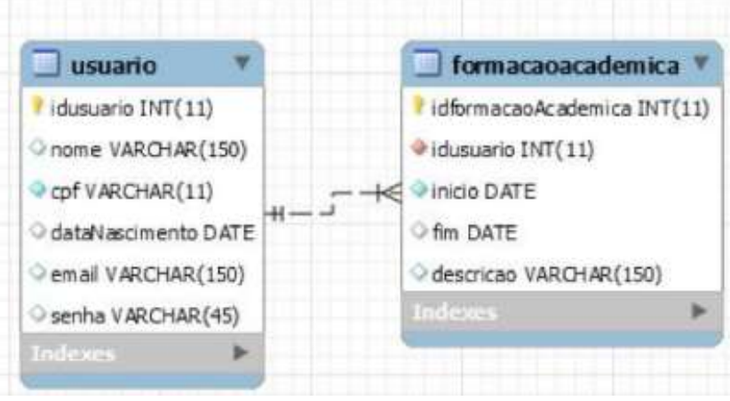
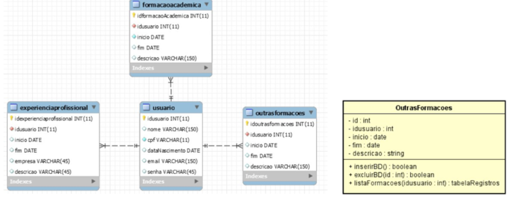

  
<h2>Estudando PHP! 🐘</h2>

Desenvolvimento de Sistemas III - ETEC

<h2>Agenda 11: Projeto Completo - Camada Model.</h2>

- com os conhecimentos adquiridos sobre Padrão MVC e PHP Orientado a Objetos, iniciaremos a construção do projeto completo.
- nessa agenda, serão aplicados conhecimentos da camada Model do Padrão MVC em um projeto com PHP
Orientado a Objetos, modelando as classes e manipulando os dados.

## 1. Banco de dados

<em>Diagrama Lógico do Banco de Dados.</em>
 

~~~sql
CREATE SCHEMA IF NOT EXISTS `projeto_final` DEFAULT CHARACTER SET latin1;
USE `projeto_final`;
-- TABLE `projeto_final`.`usuario`
CREATE TABLE IF NOT EXISTS `projeto_final`.`usuario` (
	`idusuario` INT(11) NOT NULL auto_increment,
    `nome` VARCHAR(150) NULL DEFAULT NULL,
    `cpf` VARCHAR(11) NOT NULL,
    `dataNascimento` DATE NULL DEFAULT NULL,
    `email` VARCHAR(150) NULL DEFAULT NULL,
    `senha` VARCHAR(45) NULL DEFAULT NULL,
    PRIMARY KEY (`idusuario`),
    UNIQUE INDEX `cpf_UNIQUE` (`cpf` ASC))
-- TABLE `projeto_final`.`formacaoAcademica`
CREATE TABLE IF NOT EXISTS `projeto_final`.`formacaoAcademica` (
	`idformacaoAcademica` INT(11) NOT NULL AUTO_INCREMENT,
    `idusuario` INT(11) NOT NULL,
    `inicio` DATE NOT NULL,
    `fim` DATE NULL DEFAULT NULL,
    `descricao` VARCHAR(150) NULL DEFAULT NULL,
    PRIMARY KEY (`idformacaoAcademica`),
    INDEX `idusuario_idx` (`idusuario` ASC),
    CONSTRAINT `idusuario`
		FOREIGN KEY (`idusuario`)
        REFERENCES `projeto_final`.`usuario` (`idusuario`)
        ON DELETE NO ACTION
        ON UPDATE NO ACTION    
    );
~~~

## 2. Camada Model

### a) Classe ConexaoBD:

- classe que será responsável por realizar a  conexão com o banco de dados. 
- dentro das chaves, inserir os 4 atributos privados:
  - serverName: nome ou ip do servidor.
  - userName: nome do usuário de conexão ao BD.
  - password: senha para conexão ao BD.
  - dbName: nome da base de dados desse projeto.

~~~php
class ConexaoBD {
  private $serverName = "localhost";
  private $userName = "root";
  private $password = "usbw";
  private $dbName = "projeto_final";

  public function conectar() {
    $conn = new mysqli($this->serverName, $this->userName, $this->password, $this->dbName);
    return $conn;
  }
}
~~~

## 3. Camada Usuário

- responsável por gerenciar os dados do usuário no projeto. 
- criar a classe e seus atributos:
  - idusuario: código único de cada registro de usuário.
  - nome: nome do usuário.
  - cpf: CPF do usuário.
  - dataNascimento: data de nascimento do usuário.
  - email: e-mail do usuário.
  - senha: senha para acesso ao site.
- criar métodos getters e setters.

~~~php
class Usuario {
  private $id;
  private $nome;
  private $cpf;
  private $email;
  private $dataNascimento;
  private $senha;

  // id
  public function setID ($id) {
    $this->id = $id;
  }

  public function getID() {
    return $this->id;
  }

  // nome
  public function setNome ($nome) {
    $this->nome = $nome;
  }

  public function getNome() {
    return $this->nome;
  }

  // cpf
  public function setCPF ($cpf) {
    $this->cpf = $cpf;
  }

  public function getCPF() {
    return $this->cpf;
  }

  // e-mail
  public function setEmail ($email) {
    $this->email = $email;
  }

  public function getEmail() {
    return $this->email;
  }

  // data de nascimento
  public function setDataNascimento ($dataNascimento) {
    $this->dataNascimento = $dataNascimento;
  }

  public function getDataNascimento() {
    return $this->dataNascimento;
  }

  // cpf
  public function setSenha ($senha) {
    $this->senha = $senha;
  }

  public function getSenha() {
    return $this->senha;
  }
}
~~~

## 4. Método inserirBD():

- dentro da classe Usuário.
- função: inserir no Banco de Dados as informações do usuário quando for invocado.
- neste primeiro momento, não vamos inserir todas as informações. 
- ao realizar o cadastro, o usuário precisará apenas fornecer: Nome, CPF, e-mail e senha. 

~~~php
  public function inserirBD() {
    require_once 'Conexao.php';

    $con = new ConexaoBD();
    $conn = $con->conectar();
    if ($conn->connect_error) {
      die("Connection failed: " . $conn->connect_error);
    }
    $sql = "INSERT INTO usuario (nome, cpf, email, senha)
    VALUES('".$this->nome."', '".$this->cpf."','". $this->email."', '".$this->senha."')";

    if ($conn->query($sql) === TRUE) {
      $this->id = mysqli_insert_id($conn);
      $conn->close();
      return TRUE;
    } else {
      $conn->close();
      return FALSE;
    }
  }
~~~

- o método foi definido como público para ser possível sua utilização após a instância de um objeto da classe Usuário.
- depois, é necessária a inclusão da classe conexãoBD.
- na sequência, após os delimitadores, devemos criar a classe e seus atributos:
  - idusuário: código único de cada registro de usuário.
  - nome: nome do usuário.
  - cpf: CPF do usuário.
  - dataNascimento: data de nascimento do usuário.
  - email: e-mail do usuário.
  - senha: senha para acesso ao site.
- em "if ($conn->query($sql) === TRUE)":
  - em caso positivo (true), obtemos o id gerado no banco de dados para que seja inserido no objeto, fechamos a conexão e retornamos TRUE.
  - em caso negativo, fechamos a conexão e retornamos FALSE.

## 5. Método carregarUsuario():

~~~php
  public function carregarUsuario($cpf) {

    require_once 'ConexaoBD.php';

    $con = new ConexaoBD();
    $conn = $con->conectar();
    if ($conn->connect_error) {
      die("Connection failed: " . $conn->connect_error);
    }

    $sql = "SELECT * FROM usuario WHERE cpf = ".$cpf;
    $re = $conn->query($sql);
    $r = $re->fetch_object();
    
    if($r != null) {
      $this->id = $r->idusuario;
      $this->nome = $r->nome;
      $this->email = $r->email;
      $this->cpf = $r->cpf;
      $this->dataNascimento = $r->dataNascimento;
      $this->senha = $r->senha;
      $conn->close();
      return true;
    } else {
      $conn->close();
      return false;
    } 
  }
~~~

- esse método segue o mesmo padrão:
  - inclusão da Classe ConexaoBD.
  - instância do Objeto da Classe ConexãoBD,
  - conexão ao Banco de Dados, com verificação do sucesso ou não.
  - confecção da sentença SQL.
  - execução da sentença, com verificação do sucesso ou não.
- a diferença é que em caso positivo, deve-se popular os dados dos objetos com o resultado da consulta ao Banco de Dados, fechando, em seguida, a conexão e por fim retornando TRUE.

## 6. Método atualizarBD():

~~~php
  public function atualizarBD() {

    require_once 'ConexaoBD.php';

    $con = new ConexaoBD();
    $conn = $con->conectar();
    if ($conn->connect_error) {
      die("Connection failed: " . $conn->connect_error);
    }

    $sql = "UPDATE usuario SET nome = '".$this->nome."', cpf = '". $this->cpf."', dataNascimento = '". $this->dataNascimento."',
    email='".$this->email."' WHERE idusuario='". $this->id. "'";

    if ($conn->query($sql) === TRUE) {
      $conn->close();
      return true;
    } else {
      $conn->close();
      return false;
    }
  }
~~~

- esse método segue o mesmo padrão:
  - inclusão da Classe ConexaoBD.
  - instância do objeto da Classe ConexãoBD,
  - conexão ao Banco de Dados, com verificação do sucesso ou não.
  - confecção da sentença SQL.
  - execução da sentença, com verificação do sucesso ou não.
- fim da classe Usuario!

## 7. Classe FormacaoAcad:

- responsável por gerenciar os dados da formação acadêmica do usuário. 
- criar o arquivo PHP com o nome “FormacaoAcad”.
- após a criação da classe, inserir seus atributos:
  - id é o código único de cada registro de formação acadêmica.
  - idusuario é o código do usário a quem pertence essa formação.
  - início é a data do início da formação.
  - fim é a data do fim da formação.
  - descrição é a descrição da formação acadêmica.

~~~php
class FormacaoAcad {
  private $id;
  private $idusuario;
  private $inicio;
  private $fim;
  private $descricao;

  // Getters e Setters

  // id
  public function setID ($id) {
    $this->id = $id;
  }

  public function getID() {
    return $this->id;
  }

  // idusuario
  public function setIdUsuario ($idusuario) {
    $this->idusuario = $idusuario;
  }

  public function getIdUsuario() {
    return $this->idusuario;
  }

  // inicio
  public function setInicio ($inicio) {
    $this->inicio = $inicio;
  }

  public function getInicio() {
    return $this->inicio;
  }

  // fim
  public function setFim ($fim) {
    $this->fim = $fim;
  }

  public function getFim() {
    return $this->fim;
  }

  // descrição
  public function setDescricao ($descricao) {
    $this->descricao = $descricao;
  }

  public function getDescricao() {
    return $this->descricao;
  }
}
~~~

## 8. Métodos da Classe FormacaoAcad:

- agora será feita a codificação de 3 métodos específicos: inserirBD, excluirBD e listaFormacoes. 

### a) formacaoAcademica():

- o primeiro método (“inserirBD”) é exatamente
como o desenvolvido para a classe Usuário, apenas mudando para a tabela (INSERT INTO).

~~~php
public function inserirBD() {
  require_once 'Conexao.php';

  $con = new ConexaoBD();
  $conn = $con->conectar();
  if ($conn->connect_error) {
    die("Connection failed: " . $conn->connect_error);
  }

  $sql = "INSERT INTO formacaoAcademica (idUsuario, inicio, fim, descricao)
  VALUES('".$this->idusuario."', '".$this->inicio."','". $this->fim."', '".$this->descricao."')";

  if ($conn->query($sql) === TRUE) {
    $this->id = mysqli_insert_id($conn);
    $conn->close();
    return TRUE;
  } else {
    $conn->close();
    return FALSE;
  }
}
~~~

### b) excluirBD():

~~~php
public function excluirBD($id) {

  require_once 'ConexaoBD';

  $con = new ConexaoBD();
  $conn = $con->conectar();
  if ($conn->connect_error) {
    die("Connection failed: " . $conn->connect_error);
  }

  $sql = "DELETE FROM formacaoAcademica WHERE idformacaoAcademica = '".$id ."';";

  if ($conn->query($sql) === TRUE) {
    $this->id = mysqli_insert_id($conn);
    $conn->close();
    return TRUE;
  } else {
    $conn->close();
    return FALSE;
  }
}
~~~

### c) listaFormacoes():

~~~php
public function listaFormacoes($idusuario) {

  require_once 'ConexaoBD.php';

  $con = new ConexaoBD();
  $conn = $con->conectar();
  if ($conn->connect_error) {
    die("Connection failed: " . $conn->connect_error);
  }

  $sql = "SELECT * FROM formacaoAcademica WHERE idusuario = '".$idusuario."'";
  $re = $conn->query($sql);
  $conn->close();
  return $re;
}
~~~

---

<h2>Você no Comando</h2>

<em>Diagrama Lógico do Banco de Dados, nomeado por Experiência Profissional.</em>
 

### Faça o que se pede:

1. Crie a Classe ExperienciaProfissional dentro da Pasta Model, de acordo com o diagrama.
2. Gere os Atributos de acordo com as informações:
  - id: código único da experiência cadastrada.
  - idusuario: código único do usuário.
  - inicio: início da experiência profissional.
  - fim: final da experiência profissional.
  - empresa: local onde obtida a experiência profissional.
  - descricao: explicação do cargo e aprendizados.
3. Crie os métodos específicos:
  - a. inserirBD.
  - b. excluirBD.
  - c. lista.

### a) Script SQL para criação da tabela ExperienciaProfissional:

~~~sql
CREATE TABLE `projeto_final`.`experienciaprofissional` (
	`idexperienciaprofissional` INT NOT NULL auto_increment,
    `idusuario` INT NOT NULL,
    `inicio` DATE NULL,
    `fim` DATE NULL,
    `empresa` VARCHAR(45) NULL,
    `descricao` VARCHAR(45) NULL,
    PRIMARY KEY (`idexperienciaprofissional`),
    INDEX `idUser_idx` (`idusuario` ASC),
    CONSTRAINT `idUser`
		FOREIGN KEY (`idusuario`)
		REFERENCES `projeto_final`.`usuario` (`idusuario`)
        ON DELETE NO ACTION
        ON UPDATE NO ACTION
);
~~~

## 1. Criando a Classe ExperienciaProfissional dentro da Pasta Model, de acordo com o diagrama: 

~~~php
class ExperienciaProfissional {}
~~~

## 2. Gere os Atributos (e métodos getters e setters):

~~~php
class ExperienciaProfissional {
  private $id;
  private $idusuario;
  private $inicio;
  private $fim;
  private $empresa;
  private $descricao;

  // Getters e Setters

  // id
  public function setID ($id) {
    $this->id = $id;
  }

  public function getID() {
    return $this->id;
  }

  // idusuario
  public function setIdUsuario ($idusuario) {
    $this->idusuario = $idusuario;
  }

  public function getIdUsuario() {
    return $this->idusuario;
  }

  // inicio
  public function setInicio ($inicio) {
    $this->inicio = $inicio;
  }

  public function getInicio() {
    return $this->inicio;
  }

  // fim
  public function setFim ($fim) {
    $this->fim = $fim;
  }

  public function getFim() {
    return $this->fim;
  }

  // empresa
  public function setEmpresa ($empresa) {
    $this->empresa = $empresa;
  }

  public function getEmpresa() {
    return $this->empresa;
  }

  // descrição
  public function setDescricao ($descricao) {
    $this->descricao = $descricao;
  }

  public function getDescricao() {
    return $this->descricao;
  }
}
~~~

## 3. Crie os métodos específicos:

### a) método inserirBD():

~~~php
public function inserirBD() {
  require_once 'Conexao.php';

  $con = new ConexaoBD();
  $conn = $con->conectar();
  if ($conn->connect_error) {
    die("Connection failed: " . $conn->connect_error);
  }

  $sql = "INSERT INTO experienciaprofissional (idusuario, inicio, fim, empresa, descricao)
  VALUES('".$this->idusuario."', '".$this->inicio."','". $this->fim."', '".$this->empresa."', '".$this->descricao."')";

  if ($conn->query($sql) === TRUE) {
    $this->id = mysqli_insert_id($conn);
    $conn->close();
    return TRUE;
  } else {
    $conn->close();
    return FALSE;
  }
}
~~~

### b) Método excluirBD():

~~~php
public function excluirBD($id) {

  require_once 'ConexaoBD';

  $con = new ConexaoBD();
  $conn = $con->conectar();
  if ($conn->connect_error) {
    die("Connection failed: " . $conn->connect_error);
  }

  $sql = "DELETE FROM experienciaprofissional WHERE idexperienciaprofissional = '".$id ."';";

  if ($conn->query($sql) === TRUE) {
    $this->id = mysqli_insert_id($conn);
    $conn->close();
    return TRUE;
  } else {
    $conn->close();
    return FALSE;
  }
}
~~~

### c) Método listaExperiencias():

~~~php
public function listaExperiencias($idusuario) {

  require_once 'ConexaoBD.php';

  $con = new ConexaoBD();
  $conn = $con->conectar();
  if ($conn->connect_error) {
    die("Connection failed: " . $conn->connect_error);
  }

  $sql = "SELECT * FROM experienciaProfissional WHERE idusuario = '".$idusuario."'";
  $re = $conn->query($sql);
  $conn->close();
  return $re;
}
~~~

---

<h2>Fichário</h2>

<em>
A equipe Alfa está com tudo! A camada Model do projeto está quase pronta, faltando apenas a última classe: “OutrasFormacoes”. A líder Bia, ofereceu um bônus no salário da equipe alfa, caso consigam entregar a última classe codificada antes do final de semana.
 
Para colocar em prática os assuntos estudados nessa agenda, ajude a equipe Alfa a desenvolver essa última classe da camada Model.
 
Com base nos Diagramas Entidade–Relacionamento (DER) e de Classe abaixo, desenvolva a classe “OutrasFormacoes” da camada Model.

</em>

<em>Diagramas da Classe OutrasFormacoes.</em>
 

~~~sql
CREATE TABLE IF NOT EXISTS `projeto_final`.`outrasformacoes` (
  `idoutrasformacoes` INT(11) NOT NULL AUTO_INCREMENT,
  `idusuario` INT(11) NOT NULL,
  `inicio` DATE NULL DEFAULT NULL,
  `fim` DATE NULL DEFAULT NULL,
  `descricao` VARCHAR(150) NULL DEFAULT NULL,
  PRIMARY KEY (`idoutrasformacoes`),
  INDEX `idusuario_idx` (`idusuario` ASC),
  CONSTRAINT `fk_idUsuario`
    FOREIGN KEY (`idusuario`)
    REFERENCES `projeto_final`.`usuario` (`idusuario`)
    ON DELETE NO ACTION
    ON UPDATE NO ACTION)
ENGINE = InnoDB
DEFAULT CHARACTER SET = latin1;
~~~

~~~php
class OutrasFormacoes {
  private $idoutrasformacoes;
  private $idusuario;
  private $inicio;
  private $fim;
  private $descricao;

  // Getters e Setters

  // id
  public function setID ($idoutrasformacoes) {
    $this->idoutrasformacoes = $idoutrasformacoes;
  }

  public function getID() {
    return $this->idoutrasformacoes;
  }

  // idusuario
  public function setIdUsuario ($idusuario) {
    $this->idusuario = $idusuario;
  }

  public function getIdUsuario() {
    return $this->idusuario;
  }

  // inicio
  public function setInicio ($inicio) {
    $this->inicio = $inicio;
  }

  public function getInicio() {
    return $this->inicio;
  }

  // fim
  public function setFim ($fim) {
    $this->fim = $fim;
  }

  public function getFim() {
    return $this->fim;
  }

  // descrição
  public function setDescricao ($descricao) {
    $this->descricao = $descricao;
  }

  public function getDescricao() {
    return $this->descricao;
  }

  // Método inserirBD()

  public function inserirBD() {
    require_once 'Conexao.php';

    $con = new ConexaoBD();
    $conn = $con->conectar();
    if ($conn->connect_error) {
      die("Connection failed: " . $conn->connect_error);
    }

    $sql = "INSERT INTO outrasformacoes (idusuario, inicio, fim, descricao)
    VALUES('".$this->idusuario."', '".$this->inicio."','". $this->fim."', '".$this->descricao."')";

    if ($conn->query($sql) === TRUE) {
      $this->idoutrasformacoes = mysqli_insert_id($conn);
      $conn->close();
      return TRUE;
    } else {
      $conn->close();
      return FALSE;
    }
  }

  // Método excluirBD()

  public function excluirBD($idoutrasformacoes) {

    require_once 'ConexaoBD';

    $con = new ConexaoBD();
    $conn = $con->conectar();
    if ($conn->connect_error) {
      die("Connection failed: " . $conn->connect_error);
    }

    $sql = "DELETE FROM outrasformacoes WHERE idoutrasformacoes = '".$idoutrasformacoes ."';";

    if ($conn->query($sql) === TRUE) {
      $this->idoutrasformacoes = mysqli_insert_id($conn);
      $conn->close();
      return TRUE;
    } else {
      $conn->close();
      return FALSE;
    }
  }

  
  // Método listaFormacoes()

  public function listaFormacoes($idusuario) {

    require_once 'ConexaoBD.php';

    $con = new ConexaoBD();
    $conn = $con->conectar();
    if ($conn->connect_error) {
      die("Connection failed: " . $conn->connect_error);
    }

    $sql = "SELECT * FROM outrasformacoes WHERE idusuario = '".$idusuario."'";
    $re = $conn->query($sql);
    $conn->close();
    return $re;
  }
}
~~~

---

[Voltar ao início.](https://github.com/monicaquintal/disciplina_DS_III_ETEC)